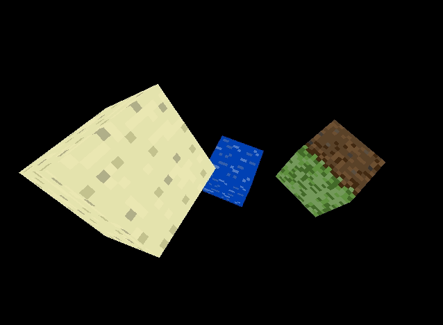
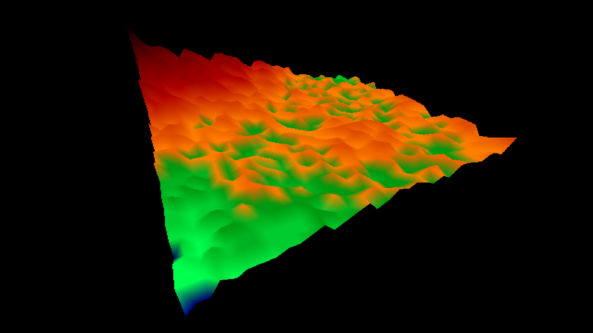
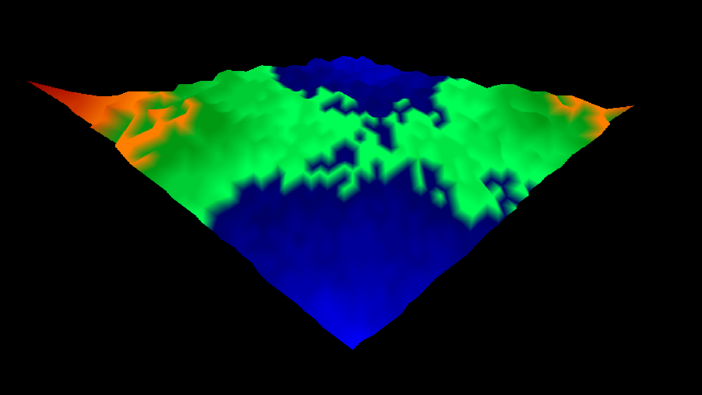
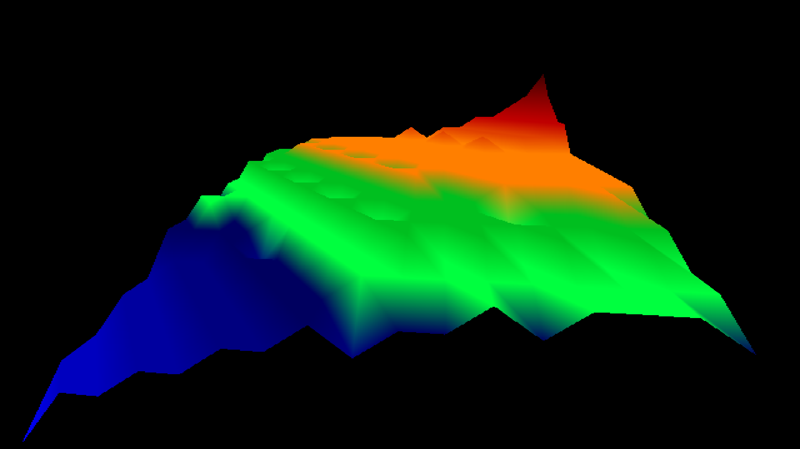

# OneMoreDimension

A little project on figuring out a 3D software renderer :). Runs in 640x480 and all rotations (including the camera rotations) are handled using Quarternions, avoiding gimbal lock. The fundementals of OpenGL were researched and the resulting engine was created using the ideologies found behind the OpenGL specification. This was a personal investigation project to see if I could figure out how to make a real 3D software renderer from first principles :P

There are two programs written using the rendering engine. Both are described below:

## 'Minecraft' Type Clone



### Running it!

Compile the C++ code with the make command. (NOTE: SDL2 library is required.)

`make compile`

Then run it!

`make run`

or to compile and run:

`make crun`

### Controls

W - Forwards\
S - Backwards\
A - Strafe Left\
D - Strafe Right\
G - Yaw camera left\
J - Yaw camera right\
Y - Pitch camera up\
H - Pitch camera down\
T - Roll camera left\
U - Roll camera right\
F - FPS test mode, with simple collision!\
R - Reset position

## Landscape generator

This is a simple landscape renderer using a Diamond-Square algoritim (array side length == 2^n + 1). The program can be given starting inputs to generate different random landscapes to be rendered in the OneMoreDimension renderer.

Here are some Examples:

Array side length: 33\
Corner 0 height: 16\
Corner 1 height: 5\
Corner 2 height: 9\
Corner 3 height: -3\
Height Variance: 2



Array side length: 33\
Corner 0 height: 15\
Corner 1 height: -7\
Corner 2 height: -2\
Corner 3 height: 13\
Height Variance: 1



Array side length: 17\
Corner 0 height: 3\
Corner 1 height: 8\
Corner 2 height: -6\
Corner 3 height: 2\
Height Variance: 0




### Running it!

Compile the C++ code with the make command. (NOTE: SDL2 library is required.)

`make compile-landscape`

Then run it!

`make run-landscape`

or to compile and run:

`make crun-landscape`

### Controls

W - Forwards\
S - Backwards\
A - Strafe Left\
D - Strafe Right\
G - Yaw camera left\
J - Yaw camera right\
Y - Pitch camera up\
H - Pitch camera down

## Rendering Engine Object/Model File Structure

VERTEX
------
`vertex _x_ _y_ _z_`

**x, y, z:** An object vertex position in Model space.

TRIANGLE
--------
`triangle _vertices_ _u0_ _v0_ _u1_ _v1_ _u2_ _v2_ _textureIndex_`

**vertices:** A list of 3 vertex number references.
**u0, v0, u1, v1, u2, v2:** The texel points of each triangle vertex.
**textureIndex:** The index of the texture loaded +1


TEXTURE
-------
`texture _filename_`

**filename:** The name of the texture file (in `objects` directory) to be loaded (only pcx format supported.)

The texture files are loaded in sequentially based on the object files loaded, and all textures are available in every texture file. (keep that in mind when using texture indexes) 

GRASS_CUBE.TXT EXAMPLE
----------------

```
vertex 0.5 0.5 -0.5
vertex 0.5 -0.5 -0.5
vertex -0.5 -0.5 -0.5
vertex -0.5 0.5 -0.5
vertex 0.5 0.5 0.5
vertex 0.5 -0.5 0.5
vertex -0.5 -0.5 0.5
vertex -0.5 0.5 0.5

triangle 1 2 3 0.0 1.0 0.0 0.0 1.0 0.0 2
triangle 1 4 3 0.0 1.0 1.0 1.0 1.0 0.0 2
triangle 5 6 7 0.0 1.0 0.0 0.0 1.0 0.0 2
triangle 5 8 7 0.0 1.0 1.0 1.0 1.0 0.0 2
triangle 2 1 5 0.0 0.0 0.0 1.0 1.0 1.0 2
triangle 2 6 5 0.0 0.0 1.0 0.0 1.0 1.0 2
triangle 3 4 8 0.0 0.0 0.0 1.0 1.0 1.0 2
triangle 3 7 8 0.0 0.0 1.0 0.0 1.0 1.0 2
triangle 1 5 8 0.0 0.0 0.0 1.0 1.0 1.0 1
triangle 1 4 8 0.0 0.0 1.0 0.0 1.0 1.0 1
triangle 2 6 7 0.0 0.0 0.0 1.0 1.0 1.0 3
triangle 2 3 7 0.0 0.0 1.0 0.0 1.0 1.0 3

texture dirt.pcx
texture dirt_side.pcx
texture grass.pcx
```

## TODOs

- Fix textures loading in globally.
- Mouse Support
- Some Lighting effects (Diffuse / Distance)

